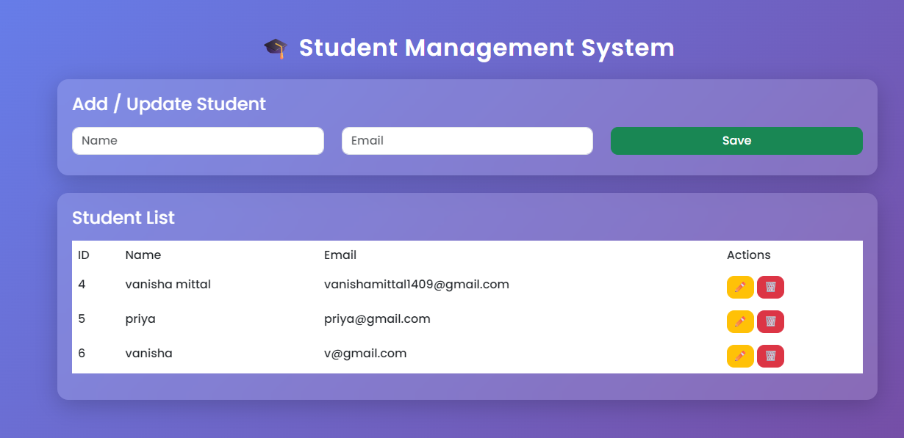

# 🎓 Student Management System

A full-stack web application built using **Spring Boot (JDBC)** and **PostgreSQL**, with a stylish frontend using **HTML, CSS, Bootstrap, and JavaScript**.

This project demonstrates complete **CRUD operations** with a clean UI and layered backend architecture.

---

## 🚀 Features

- ✅ Add Student  
- 📄 View All Students  
- 🔍 View Student by ID  
- ✏️ Update Student  
- 🗑️ Delete Student  
- 🎨 Modern UI (Glassmorphism + Bootstrap)  
- 🔗 REST API Integration  
- 💾 PostgreSQL Database  

---

## 🖼️ Screenshots

---

## 🏗️ Tech Stack

### 🔹 Backend
- Java  
- Spring Boot  
- JDBC
- Maven  

### 🔹 Frontend
- HTML  
- CSS (Bootstrap + Custom)  
- JavaScript

### 🔹 Database
- PostgreSQL  
- DBeaver  

